# Contra BLE Keyboard tutorial 

This tutorial is what I did to convert a normal [Contra keyboard](https://cartel.ltd/projects/contra/) into a bluetooth keyboard. 

I've started with blanked kit, but if you already build it and are willing to desolder the Pro Micro and all the switches, this is the right tutorial for you!

## List of materials 

* [Sparkfun Pro Micro - 3.3V/8MHz](https://www.sparkfun.com/products/12587) - We need to switch from the 5v Pro Micro that comes on your kit to a 3.3v Pro Micro to make the keyboard more energy efficient and suitable to run on a battery.
* [Adafruit Bluefruit LE SPI Friend - Bluetooth Low Energy (BLE)](https://www.adafruit.com/product/2633) - This BLE module is well supported by the QMK firmware.
* [Adafruit LiIon/LiPoly Backpack Add-On for Pro Trinket/ItsyBitsy](https://www.adafruit.com/product/2124) - A tiny module that will charge the battery when the keyboard is connected through USB.
* [Eachine EV800 FPV Goggles Spare Part 3.7V 2000mAh Lipo Battery](https://www.banggood.com/Eachine-EV800-FPV-Goggles-Spare-Part-3_7V-2000mAh-Lipo-Battery-p-1072727.html) - A nice and compact battery that fits on the 3D printed support. You can use whatever Lipo battery you like as long as it fits on the support.
* [Breadboard-friendly SPDT Slide Switch](https://www.adafruit.com/product/805) - I've used this switch to modulate the support, but you can also use any switch as long as it fits on the support.
* 1N5817 Schottky diode - We need a diode to prevent the Vcc current (500mA) from flowing into the battery when charging the keyboard.
* 30AWG Wire - To connect the the components and solder into the MEGA32U4 pads directly.
* Hot glue 
* Labels 
* Electrical tape 
* 3x 2mm diameter washers 
* 3x 6mm heigh standoffs 
* 3x M2*8mm head hex socket screws - I used this to screw the printed support 
* Access to a 3D Printer - To print the [components support](https://www.thingiverse.com/thing:3516520)

## The plan 
Since the Arduino does not have enough pins available to connect the Bluetooth module, we will need to hack and reroute the following pin directly from the microcontroller chip:

Here's the package wiring in detail:

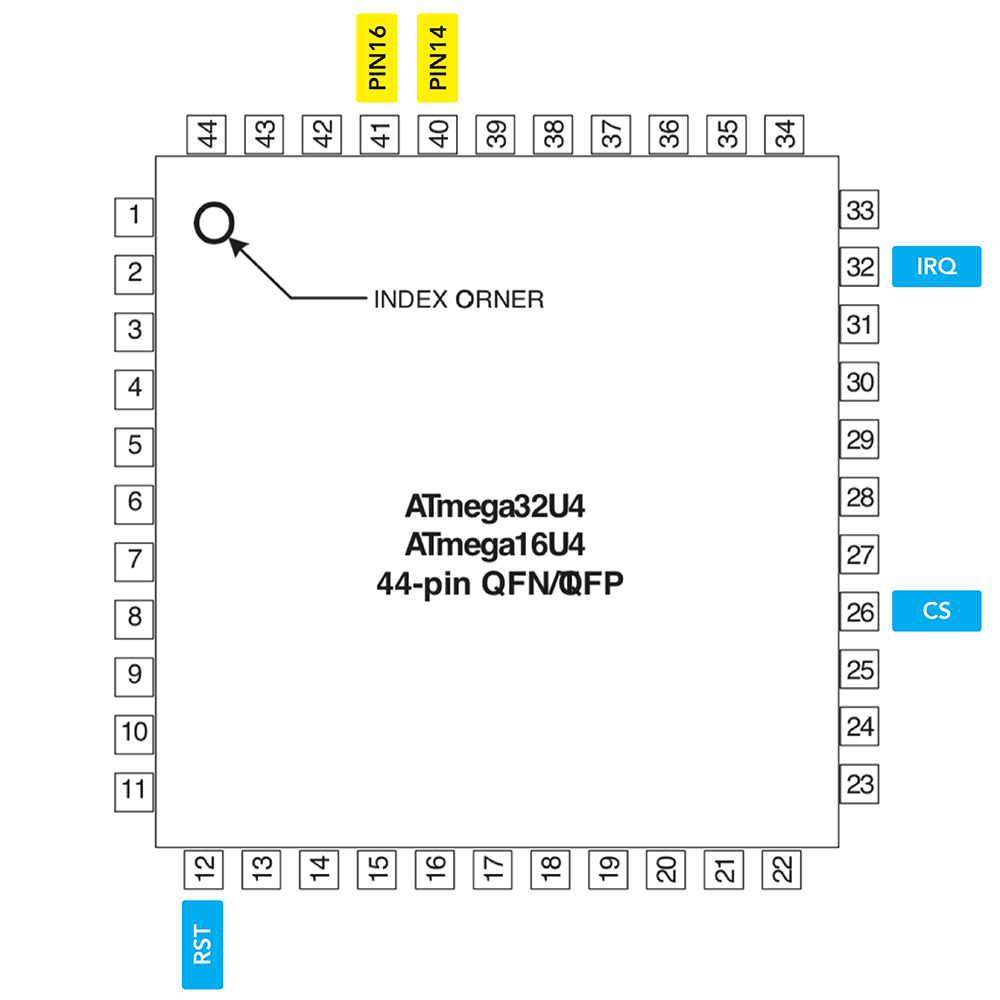

We are also going to use the `RAW` Pin (5v) from the Arduino to charge the battery. 

The `VCC` Pin (3.3v) will have two roles - To supply power to the Adafruit Bluefruit when charging through USB and to receive power from the battery when the keyboard is wireless.
  

## Building process
First I suggest labeling every wire connection to keep track of what is what. Things will get messy in no time. 

**Step 0.**
Download the STL file of the components support from thingiverse ([link](https://www.thingiverse.com/thing:3516520)) and print it.

You can print in any material as long as it hard enough. I recomend PLA since it's easy to work with.

**Step 1.**
Follow the Contra's [assembly guide](https://cartel.ltd/projects/contra/#assembly) until step 3.

**Step 2.**
Remove the 2 header pins (the `PIN 14` and `PIN 16`) from the right headers row and solder some hires in their place , like so: 

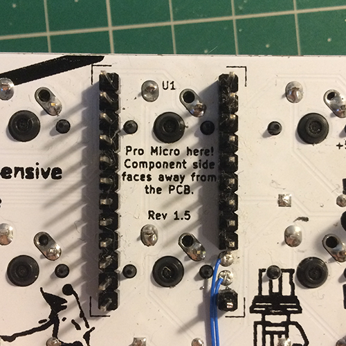 

Please lable this wires. After the next step it will be easier to identify which is which.
 
**Step 3.**
Follow the Contra's [assembly guide](https://cartel.ltd/projects/contra/#assembly) until step 7B.

**Step 4.**
This is the pièce de résistance! We will solder every wire into the Pro Micro.

**Step 4A.** Start by soldering those two wires from **Step 2.** (the `PIN 14` and `PIN 16`) into the MEGA32U4's pads.

**Step 4B.** After this, solder some wires to the `IRQ`, `CS` and `RST` pads. Suggestion - Tape each wire to the keyboard after soldering, and label them. **be careful, these connections are really delicate!**

**Step 4C.** Solder the remaining `5v`, `GND`, `3.3v`, `CLK`, `MISO` and `MOSI`. For the Power and GND pins solder Red and Black wires 
respectively, it's convention best practice. Don't forget to label them as well.

You should have something like this:

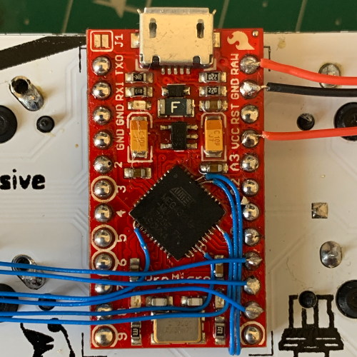 

**Step 4D.** 
You can put some hot glue on the chip connections so that they don't falloff, they are really delicate! Be careful.

**Step 5.** Let's move into something more easy. Prepare the ON/OFF switch by soldering two wires into it's pins. You can cut the extra pin, you'll not need it.

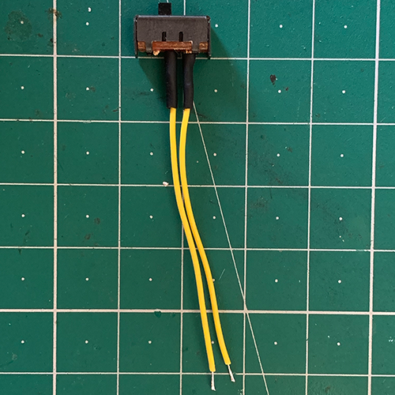 

**Step 6.** Prepare the LiPoly Backpack by adding a Schottky diode on the `BAT` and a wire `GND` pins, like the image shows. **Note that the orientation of the diode!!!** If it's backwards it will not work and you can damage your battery. 

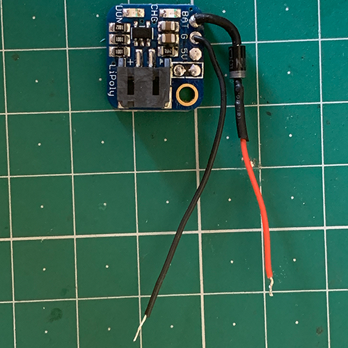 

**Step 6A.** Cut the trace that allows the ON/OFF functionality on this module. You can also solder the 500 mA charging rate, it's optional but I recommend it. For more info you can check [Adafruit's Documentation](https://learn.adafruit.com/adafruit-pro-trinket-lipoly-slash-liion-backpack/pinouts)

**Step 7.** 
To prevent any short circuit, put some electrical tape on this spot, the LiPoly Backpack will be on top of it.

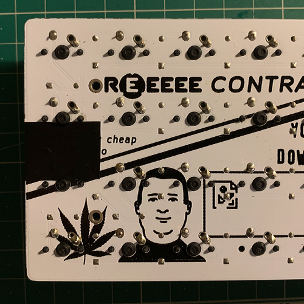

**Step 8.** 
Grab your 3d printed support and add it the power switch and the LiPo backpack. Screw all it in the keyboard with washers between standoffs and solder the the switch wires into the battery modules. Like so:

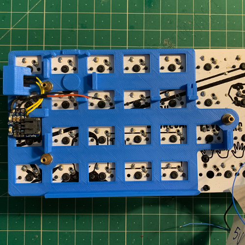

**Step 9.**
Now it's time to solder the wires into the Bluefruit module. Start by the power wires (`5v`, `GND`, `3.3v`) and them the communication wires (`RST`, `IQR`, `CS`, `MOSI`, `MISO`, `CLK`). Pass the wires through the support hole, the final result should be something like this:

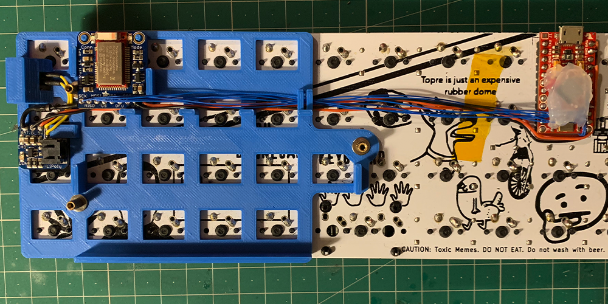

**Step 9A.**
The `5v` wire goes straight to the LiPoly Backpack 5v terminal:

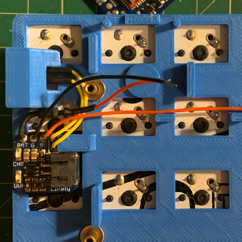

**Step 9B.**
After this try to manage the cables from the battery module a bit. By routing them on the back of the BLE module (twist them to keep them in place)

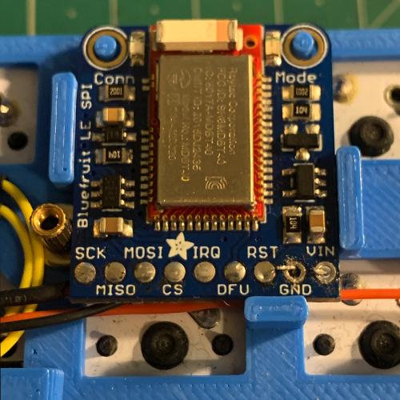

**Step 9C.**
With the module in place, solver the `3.3v` wire from the Arduino into the VIN's BLE terminal.

The `GND` wire that also comes from the Arduino should be solder on the BLE's terminal, 

Connecting the battery module `GND` and `VBAT` in the process.

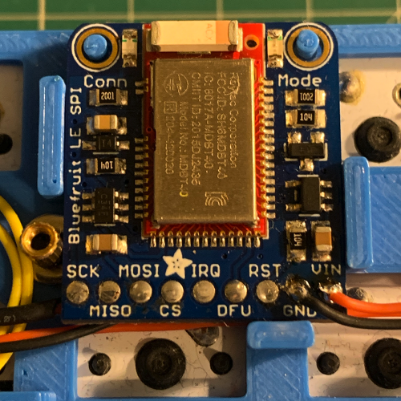

**Step 9D.**
Now solder, the remaining communication wires into the BLE module by the following order: `RST`, `IQR`, `CS`, `MOSI`, `MISO`, `CLK` (the `SCK` on the module is the `CLK`)

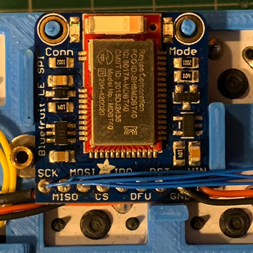

**Step 10.**
Make sure that everything is well soldered. Glue the module and the cables to keep things more tight. Connect the battery. 
Flash the firmware and...

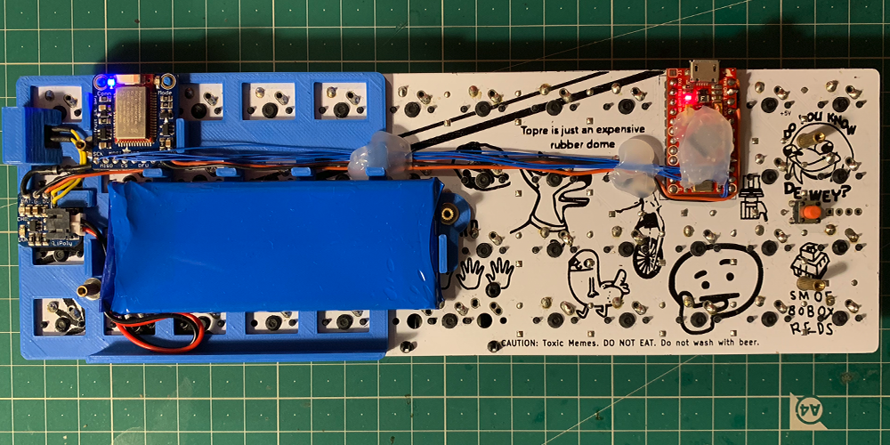

<h3>Enjoy your wireless Contra!!!</h3>
